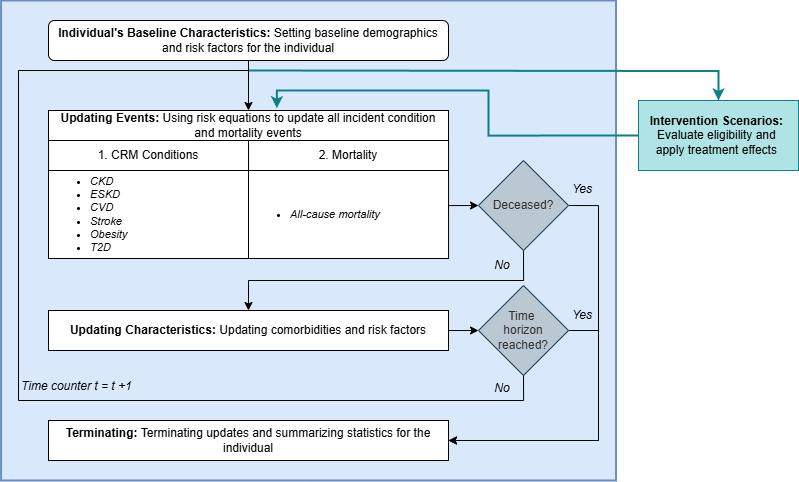

# Global Epidemiology Multimorbidity (GEM) Microsimulation Model

**Resources:** [GitHub Repository](https://github.com/emitchell16/gem) | **Publications:** Manuscripts currently in preparation

## Overview

The Global Epidemiology Multimorbidity (GEM) Microsimulation Model is a population health simulation framework designed to evaluate the burden of chronic diseases and the potential impact of clinical and public health interventions across diverse global populations. 

By integrating demographic and epidemiologic data from the United Nations, the Global Burden of Disease (GBD) Study, NCD Risk Factor Collaboration (NCD-RisC), and the World Health Organization (WHO), GEM projects future health outcomes, quantifies disease burden, and estimates the population-level effects of prevention and treatment strategies across countries, age groups, and sexes.

The model was developed to address the need for globally applicable simulation tools, particularly in settings where empirical evidence is unavailable. GEM leverages internationally standardized data sources to support analyses across a large number of countries and territories and can be adapted to evaluate the health and economic impacts of a wide range of diseases, interventions, and policy scenarios.

## Current Applications of the GEM Model

### Global Semaglutide Access Scenarios \& Cost-Effectiveness Analysis

Simulation of semaglutide access ranging from 10% to 100% treatment coverage among individuals with obesity and/or type 2 diabetes, with projected impacts on obesity prevalence, cardio-renal-metabolic disease incidence, stroke, and mortality.

### Long-Term Epidemiologic Validation Across Global Populations

Evaluation of the model's ability to reproduce observed chronic disease incidence and mortality patterns over multi-year follow-up periods using population-based cohort studies from diverse geographic regions. This validation framework assesses the extent to which internationally available epidemiologic inputs (including GBD and NCD-RisC estimates) can accurately project long-term disease outcomes beyond single-year forecasting horizons.

## Methods

Detailed descriptions of model development, input data sources, calibration procedures, validation analyses, and application-specific methods are available in the project README, associated manuscripts, and supplementary appendices.

<h3 align="center">Global Epidemiology Multimorbidity (GEM) Microsimulation Model Algorithm</h3>

  

## Repository Structure

- `00\_Code/`: source code for data processing, model development, simulation, calibration, and analysis

- `01\_Data/`: input data required for model execution

- `02\_Working/`: intermediate files. currently contains post-validation calibration parameters required for reproducibility

- `03\_Results/`: user-generated output files, simulation results, tables, and figures created after running the model.

- `docs/`: project website files

- `GEM\_documentation\_workbook.xlsx`: documentation workbook with references for model inputs, epidemiologic parameters, and studies used in validation

## Citation

If you use the GEM Microsimulation Model in research, please cite:

Mitchell E, Shao H. Global Epidemiology Multimorbidity (GEM) Microsimulation Model. GitHub repository. 2026.

## Contact

Elizabeth Mitchell

Emory University

estaton@emory.edu

Hui Shao

Emory University

hui.shao@emory.edu

*Researchers interested in applying or extending the GEM framework are encouraged to contact the model developers to discuss potential collaboration and appropriate acknowledgment of model development contributions.*

